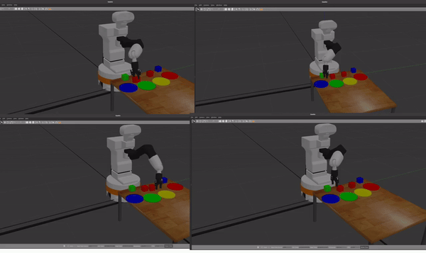

# ELSA: Robotics Use Case Benchmark
Development repository for the Robotics Use Case Benchmark: A ROS package to run Reinforcement Learning experiments, particularly pick and place tasks, on the TIAGo robot.
It allows to run multiple instances of ROS and Gazebo running in parallel, so that are accessible by multiple parallel process. It is suggested to use of workers to collect exeperience, while another process updates the AI in parallel (it implies the use of off-policy algorithms).




## Installation
Tested on Ubuntu 20.04 only. 
- Install ROS Noetic + TIAGo
    -  http://wiki.ros.org/Robots/TIAGo/Tutorials/Installation/InstallUbuntuAndROS
- Install openai_ros package into your TIAGo workspace
    ``` bash
     cd /home/user/tiago_public_ws/src
     git clone https://bitbucket.org/theconstructcore/openai_ros.git
     cd openai_ros;git checkout version2
     cd /home/user/tiago_public_ws;catkin_make;source devel/setup.bash
    ``` 
- Install elsa_tiago_gym package into your TIAGo workspace
    ``` bash
     cd /home/user/tiago_public_ws/src
     git clone https://github.com/AdrianoPaccia/elsa_tiago_gym.git
     cd /home/user/tiago_public_ws;catkin_make;source devel/setup.bash
    ``` 
- Install elsa_tiago_fl package into your TIAGo workspace
    ``` bash
     cd /home/user/tiago_public_ws/src
     git clone https://github.com/AdrianoPaccia/elsa_tiago_fl.git
     cd /home/user/tiago_public_ws;catkin_make;source devel/setup.bash
    ```
    
# Setup
Create a virtual environment or pyenv with `python==3.10.6`. 
Run:
``` bash
 cd /home/user/tiago_public_ws;pip install -r src/elsa_tiago_fl/requirements.txt
``` 

# Train
To train with FL, run:
```bash
roscd elsa_tiago_fl
python3 src/elsa_tiago/gym_fl_train.py -e [ENVIRONMENT] -m [MODEL] -n_workers [N. WORKERS]
```
With:

- `MODEL={dqn_new}`
- `ENVIRONMENT={tiago-v2_discrete}`
- `ENVIRONMENT {1,...,10}`

To modify the training parameters check `configs/models/[MODEL].yaml`.

For killing all parallel ROS-Gazebo simulations:
    ```bash
    roscd elsa_tiago_gym
    ./src/simulations/kill_simulations.sh 
    ```
